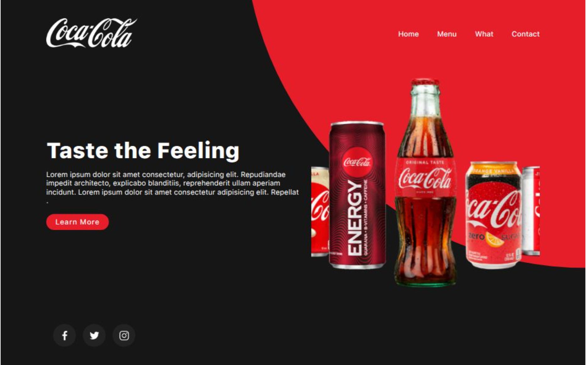

# 🥃 Clone da Coca-Cola

### Autor: Ender J. Guaina V.



Um site responsivo de clone da Coca-Cola com HTML, CSS e JavaScript. O projeto conta com uma interface moderna, animações fluidas e foco em acessibilidade para todos os dispositivos.

🔗 **[Acesse o site aqui](https://projeto-coca-cola-psi.vercel.app/)**

---

## ✨ Recursos

- 💡 **Design Responsivo:** Desenvolvido com a abordagem *Mobile First*, adaptando-se perfeitamente a dispositivos móveis, tablets e desktops.
- 🌐 **Compatível com Todos os Navegadores Modernos**
- 💎 **Clone de Grande empresa do mercado de Streaming**

---

## 🛠️ Tecnologias Utilizadas

- HTML5
- CSS3 (Flexbox & Grid)
- JavaScript

---

## 🚀 Como Rodar Localmente

1. **Clone o repositório:**
   ```bash
   git clone https://github.com/EnderJGV/Clone_da_netflix.git
